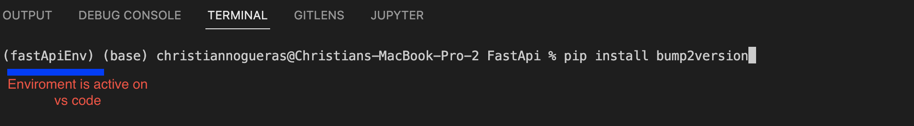

## Description

:bulb: Still work in progress

## Getting started

1. create a new virtual enviroment [Youtube tutorial](https://www.youtube.com/watch?v=TSH4C1Zipcs)
2. install dependency `pip install -r /path/to/requirements.txt`
3. `uvicorn main:app --reload`. [Ref](https://fastapi.tiangolo.com/#run-it). This will start on port 8000. If you are using visual code you can click on the play button on the top bar and it will start the project

## Tech stack

1. [Fast API](https://fastapi.tiangolo.com/#run-it) as the python web framework.
2. The documentation for the API is [here](https://bwtkx9.deta.dev/docs). It's auto generated by Fast API following the [open api schema](https://swagger.io/specification/)
3. There is available a node.js [SDK](https://www.npmjs.com/package/@kiri23/fastapi) generated from the open api schema. The SDK is hosted on npm and can be installed running the command `npm i @kiri23/fastapi` on a terminal

## Roadmap

[Trello](http://trello.com/) is used to manage the task done on the project and the one to come. If you want access to the board [here](https://trello.com/invite/b/KZ3C27S5/7a9513d8f4bdbfea980248ea59daab18/fastapi-sdk) is an invite link

## Versioning

This API use semantic versioning. The management of the versions is done by [bump2version](https://pypi.org/project/bump2version/)

## Release Process

The deploy and generation of the SDK are done through [Github actions](https://github.com/Kiri23/fastapi/actions).

## FAQ

### Installing new libraries

1. Start the virtual enviroment, if you open the vs code terminal it would be set with the enviroment. [Youtube tutorial](https://www.youtube.com/watch?v=TSH4C1Zipcs)
   

2. `pip install <new library>`
3. ` pip freeze > requirements.txt`
